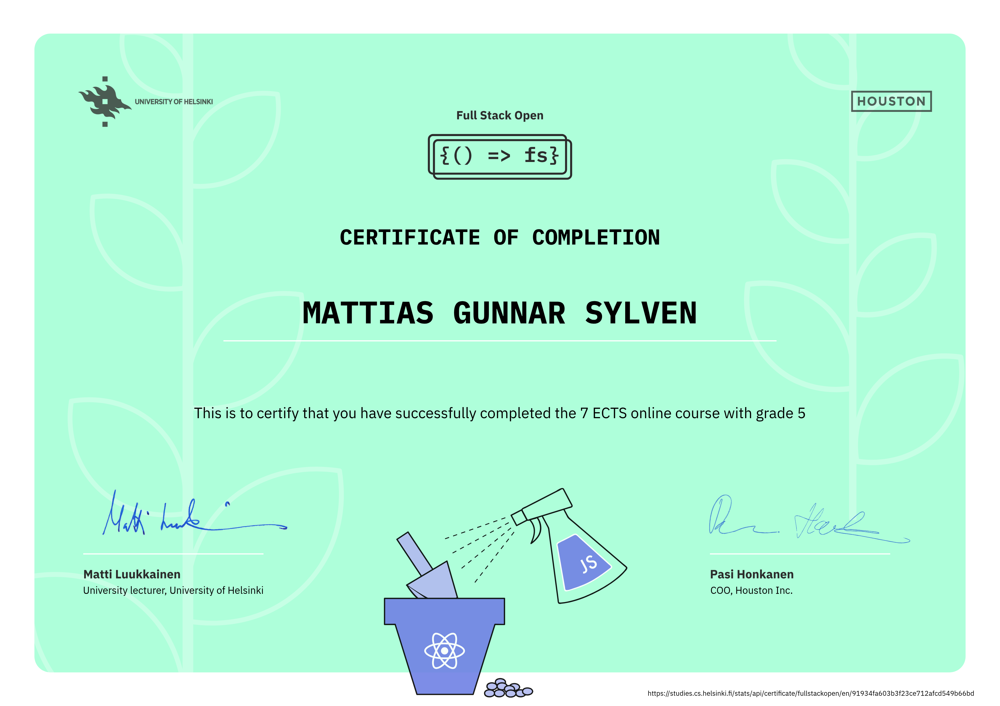

# full-stack-open
This repo contains my submitted solutions to the exercises for the University of Helsinki [Full Stack Open](https://fullstackopen.com/en/) course. Solutions are submitted part-by-part (final version of each sub-part)

<br>

Repo structure:
```
full-stack-open/
├── part0/
├── part1/
│   ├── courseinfo/
│   ├── unicafe/
│   └── anecdotes/
└── partx/
```
<br>

Progression:
| Part | Topic | Completed ex. | Submitted |
|:--------:|:--------|:--------:|:--------:|
| 0 | [Fundamentals of Web apps](https://fullstackopen.com/en/part0)                                          |6 / 6 | ✔ | 
| 1 | [Introduction to React](https://fullstackopen.com/en/part1)                                             | 14 / 14 | ✔ | 
| 2 | [Communicating with server](https://fullstackopen.com/en/part2)                                         | 20 / 20 | ✔ | 
| 3 | [Programming a server with NodeJS and Express](https://fullstackopen.com/en/part3)                      | 22 / 22 | ✔ | 
| 4 | [Testing Express servers, user administration](https://fullstackopen.com/en/part4)                      | 23 / 23 | ✔ | 
| 5 | [Testing React apps](https://fullstackopen.com/en/part5)                                                | 23 / 23 | ✔ | 
| 6 | [Advanced state management](https://fullstackopen.com/en/part6)                                         | 24 / 24 | ✔ | 
| 7 | [React router, custom hooks, styling app with CSS and webpack](https://fullstackopen.com/en/part7)      | 21 / 21 | ✔ | 
| 8 | [GraphQL](https://fullstackopen.com/en/part8)                                                           | / | . | 
| 9 | [TypeScript](https://fullstackopen.com/en/part9)                                                        | / | . | 
| 10 | [React Native](https://fullstackopen.com/en/part10)                                                    | / | . | 
| 11 | [CI/CD](https://fullstackopen.com/en/part11)                                                           | / | . | 
| 12 | [Containers](https://fullstackopen.com/en/part12)                                                      | / | . | 
| 13 | [Using relational databases](https://fullstackopen.com/en/part13)                                      | / | . | 

<br>

Completed parts:

Parts 0-5 (core course) - Full Stack Web Development (5 cr, CSM141081)<br>
Part 6 - Full Stack Web Development, extension 1 (1 cr, CSM141082)<br>
Part 7 - Full Stack Web Development, extension 2 (1 cr, CSM141083)<br>


