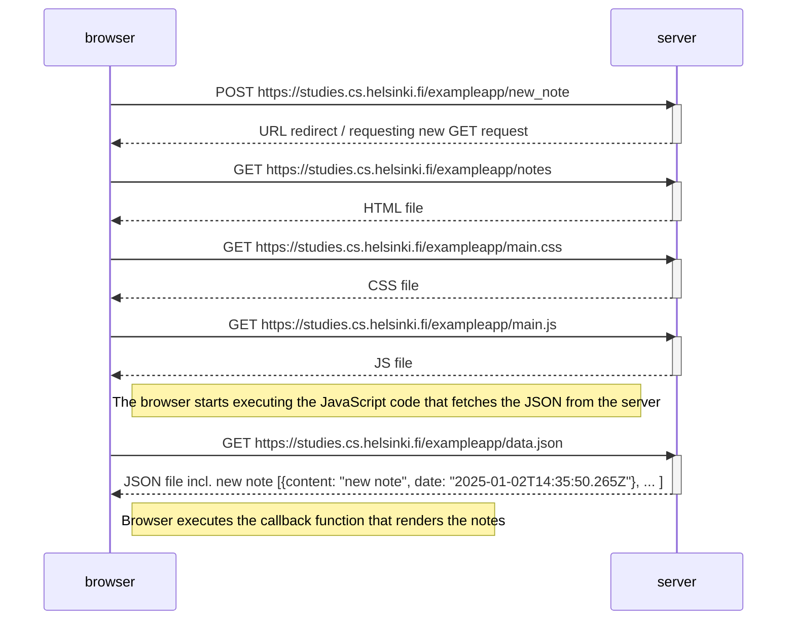

```mermaid
sequenceDiagram
    participant browser
    participant server

    browser->>server: POST https://studies.cs.helsinki.fi/exampleapp/new_note
    activate server
    server-->>browser: URL redirect / requesting new GET request
    deactivate server

    browser->>server: GET https://studies.cs.helsinki.fi/exampleapp/notes
    activate server
    server-->>browser: HTML file
    deactivate server

    browser->>server: GET https://studies.cs.helsinki.fi/exampleapp/main.css
    activate server
    server-->>browser: CSS file
    deactivate server

    browser->>server: GET https://studies.cs.helsinki.fi/exampleapp/main.js
    activate server
    server-->>browser: JS file
    deactivate server

    Note right of browser: The browser starts executing the JavaScript code that fetches the JSON from the server

    browser->>server: GET https://studies.cs.helsinki.fi/exampleapp/data.json
    activate server
    server-->>browser: JSON file incl. new note [{content: "new note", date: "2025-01-02T14:35:50.265Z"}, ... ]
    deactivate server

    Note right of browser: Browser executes the callback function that renders the notes
```