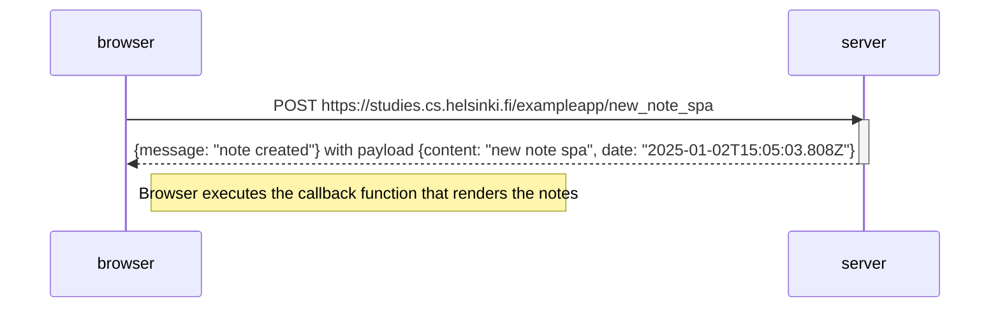

```mermaid
sequenceDiagram
    participant browser
    participant server

    browser->>server: POST https://studies.cs.helsinki.fi/exampleapp/new_note_spa
    activate server
    server-->>browser: {message: "note created"} with payload {content: "new note spa", date: "2025-01-02T15:05:03.808Z"}
    deactivate server

    Note right of browser: Browser executes the callback function that renders the notes
```